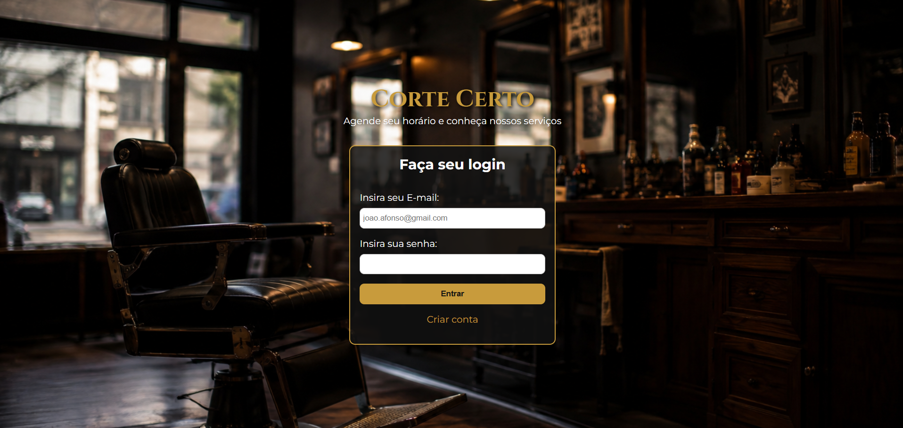
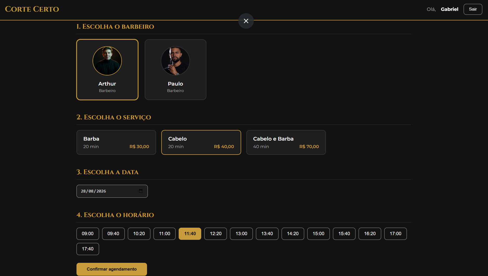
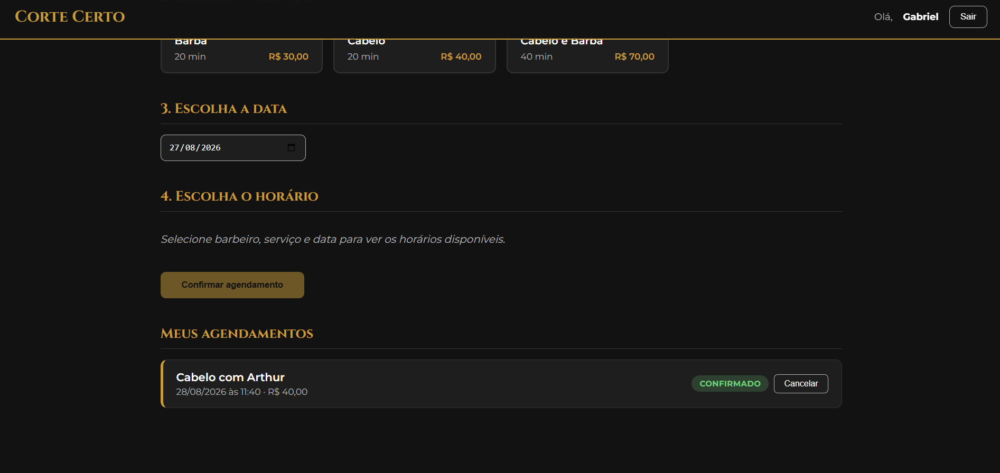
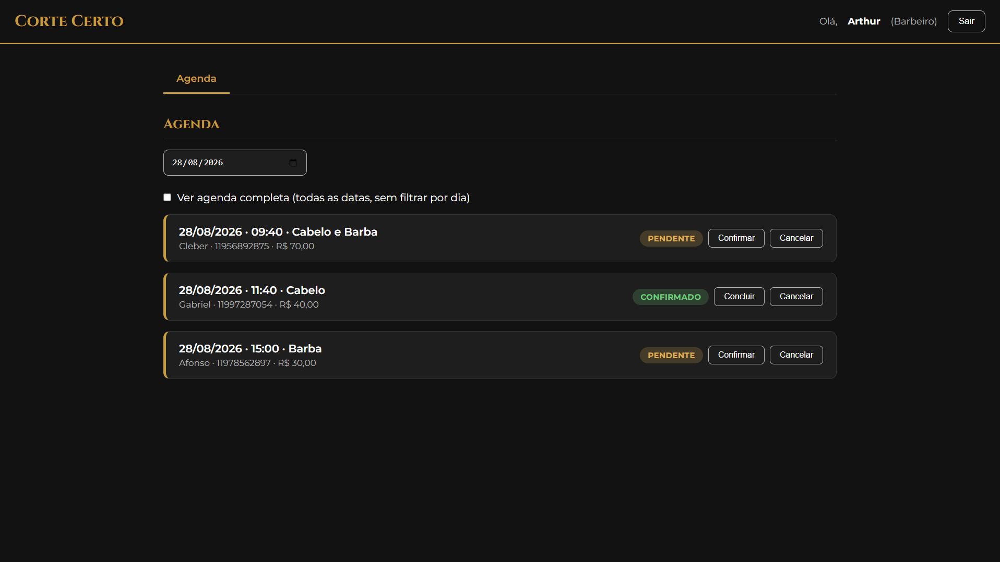
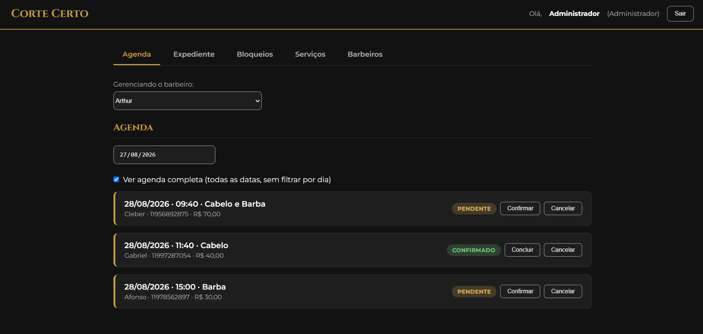
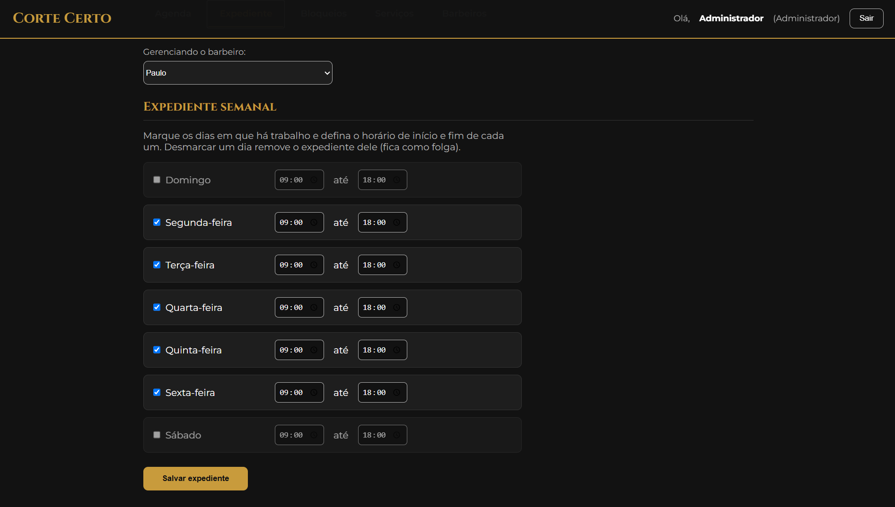
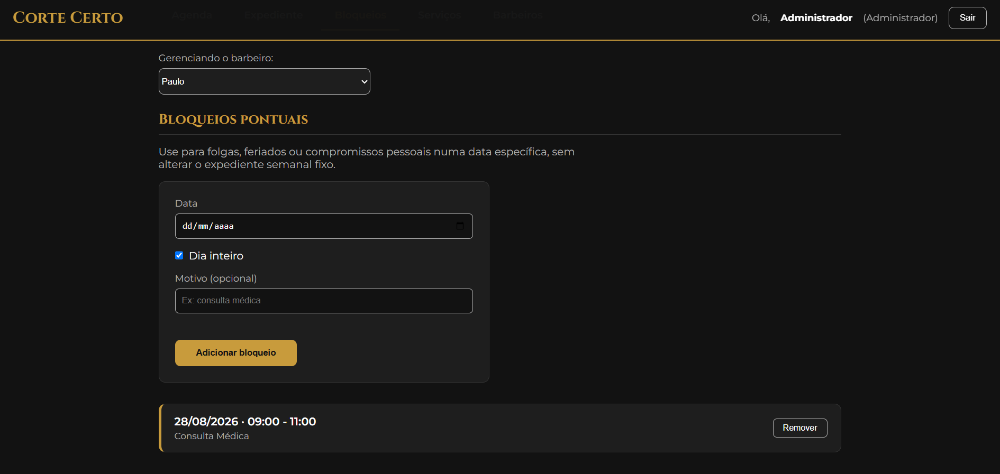
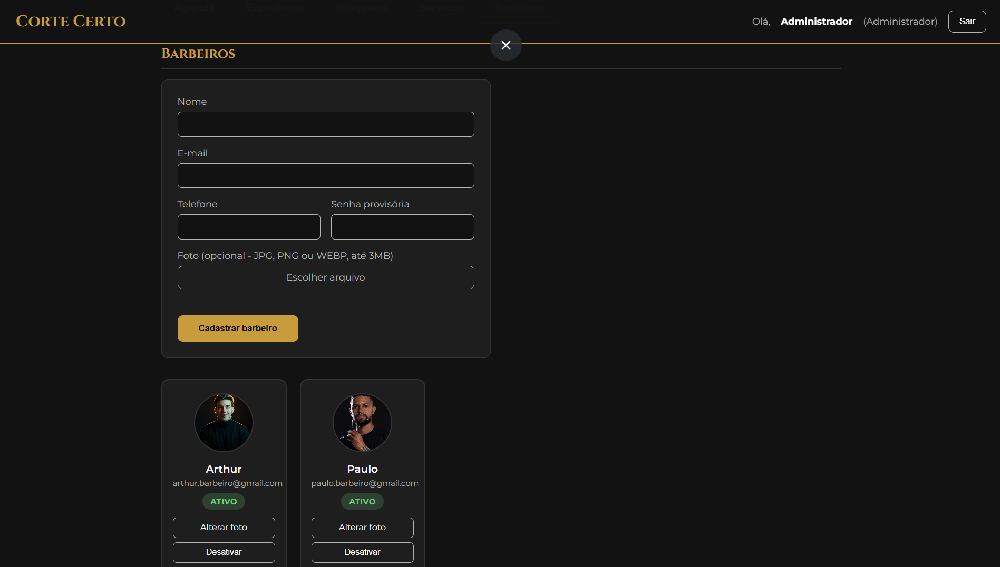
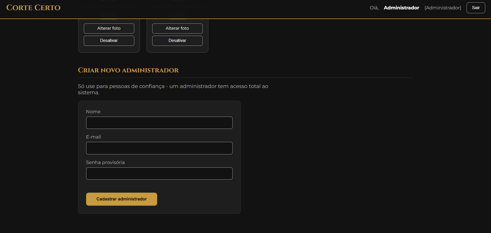

# Corte Certo

Sistema full stack de agendamento online para barbearias — substitui o controle manual por WhatsApp/telefone por uma agenda automatizada que calcula disponibilidade em tempo real e nunca permite dois agendamentos no mesmo horário.


Desenvolvido por **Gabriel Morais**.

---

## Sobre o projeto

Barbearias pequenas costumam gerenciar horários manualmente, o que gera conflitos de agenda e retrabalho. O Corte Certo resolve isso com uma API REST própria, autenticação real (JWT + bcrypt) e uma regra de negócio que calcula, para cada barbeiro, quais horários realmente estão livres — cruzando o expediente semanal dele, as folgas pontuais e os agendamentos já confirmados.

O sistema tem três perfis de acesso (cliente, barbeiro e administrador), cada um com uma tela e um conjunto de permissões diferente, e foi construído em camadas para refletir como um back-end profissional é organizado na prática.

## Stack técnica

- **Front-end:** HTML5, CSS3 e JavaScript puro (sem frameworks), responsivo com Flexbox/Grid
- **Back-end:** Node.js + Express, organizado em camadas (`routes` → `controllers` → `services`, com `middlewares` de autenticação/autorização/erro)
- **Banco de dados:** MySQL, com queries parametrizadas em todas as camadas (proteção nativa contra SQL Injection) e um usuário de aplicação com privilégios restritos (sem DDL)
- **Autenticação:** JWT para sessão + bcrypt para hash de senha
- **Upload de imagem:** Multer, com armazenamento em disco e limite de tamanho/tipo de arquivo

## Funcionalidades principais

- Cadastro e login com dois fluxos de acesso: cliente (autocadastro público) e equipe (barbeiro/admin, criado só por um administrador)
- CRUD de serviços (nome, duração, preço), com desativação em vez de exclusão (preserva o histórico de agendamentos antigos)
- Cálculo dinâmico de disponibilidade: cruza expediente semanal + bloqueios pontuais + agendamentos existentes, respeitando a duração de cada serviço
- Criação de agendamento protegida contra condição de corrida (duas pessoas não conseguem reservar o mesmo horário mesmo clicando ao mesmo tempo)
- Painel do barbeiro para acompanhar e confirmar/concluir/cancelar a própria agenda
- Painel do administrador para gerenciar barbeiros (com foto), expediente, folgas, catálogo de serviços e outros administradores
- API REST completa cobrindo tudo isso, com autorização por papel em cada rota

## Como funciona — por perfil

### 👤 Cliente

O cliente cria conta e escolhe, em quatro passos, com quem e quando quer ser atendido: barbeiro → serviço → data → horário. A lista de horários mostrada já vem filtrada pelo servidor — só aparece o que está realmente disponível para aquele barbeiro, naquele dia, considerando a duração do serviço escolhido. Depois de confirmar, o agendamento aparece em "Meus agendamentos", onde também é possível cancelá-lo.

<table>
<tr>
<td width="50%">

**Login**


</td>
<td width="50%">

**Cadastro**


</td>
</tr>
<tr>
<td width="50%">

**Agendamento em 4 passos**


</td>
<td width="50%">

**Meus agendamentos**


</td>
</tr>
</table>

### ✂️ Barbeiro

O barbeiro só enxerga a própria agenda — não define preços, não mexe no catálogo de serviços e não configura o próprio expediente (isso é decisão do administrador, para manter uma política única na barbearia). Na tela dele, dá pra ver os agendamentos do dia e confirmar, concluir ou cancelar cada um, ou marcar "ver agenda completa" pra enxergar todos os agendamentos futuros de uma vez, sem filtrar por data.



### 🛠️ Administrador

O administrador tem acesso total: gerencia a agenda, o expediente semanal e os bloqueios pontuais de **qualquer** barbeiro (escolhendo-o num seletor), cadastra novos barbeiros (com foto), ativa/desativa contas, mantém o catálogo de serviços e pode criar outros administradores.

<table>
<tr>
<td width="50%">

**Agenda (com seletor de barbeiro)**


</td>
<td width="50%">

**Expediente semanal**


</td>
</tr>
<tr>
<td width="50%">

**Bloqueios pontuais**


</td>
<td width="50%">

**Gestão de barbeiros**


</td>
</tr>
</table>



## Destaque técnico: disponibilidade sem conflitos

A parte mais delicada do projeto não é mostrar horários livres — é garantir que dois clientes não consigam reservar o mesmo horário ao mesmo tempo. A solução:

1. **Leitura (cálculo de horários):** o back-end gera candidatos de horário dentro do expediente do barbeiro, remove o que colide com bloqueios pontuais ou agendamentos existentes, e só então devolve a lista ao cliente.
2. **Escrita (criação do agendamento):** ao confirmar, o servidor abre uma transação e trava a linha do barbeiro (`SELECT ... FOR UPDATE`) antes de checar disponibilidade de novo. Isso serializa as criações de agendamento por barbeiro — duas requisições simultâneas para o mesmo horário nunca passam as duas pela checagem; a segunda só é processada depois que a primeira já commitou (ou não), então ela enxerga a realidade atualizada e é corretamente rejeitada com `409 Conflict` se o horário já foi ocupado.

Esse fluxo foi testado disparando requisições em paralelo (`Promise.all`) contra o mesmo horário: o resultado é sempre um sucesso e um conflito, nunca dois sucessos.

## Estrutura do projeto

```
Agendamento Barbearia/
├── backend/                 # API REST (Node.js + Express)
│   └── src/
│       ├── config/           # conexão com o MySQL
│       ├── routes/           # mapeamento de URL → controller
│       ├── controllers/      # validação de entrada e resposta HTTP
│       ├── services/         # regras de negócio e queries
│       └── middlewares/      # autenticação, autorização, upload, erros
├── public/                   # front-end estático (servido pelo próprio Express)
├── database/                 # schema.sql + migrações versionadas
└── docs/screenshots/          # imagens usadas neste README
```

## Autor

**Gabriel Morais**
